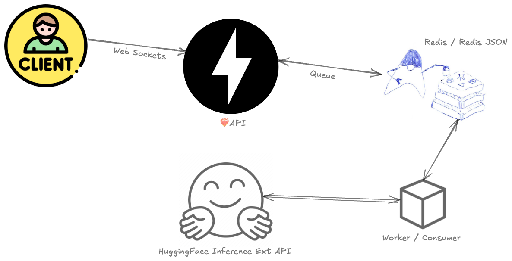

# `pythuto-chan`: Your Local AI Chatbot

<div align="left">
  
</div>
<br>

<div align="left">
  
</div>
<br>

`pythuto-chan` is a local AI chatbot application built using Python's FastAPI, HuggingFace's inference API, and Redis for memory storage. Inspired by the beloved anime character Naruto, Pythuto-chan brings the power of AI to your local environment.

## Features

- **FastAPI**: A modern, fast (high-performance) web framework for building APIs with Python.
- **HuggingFace Inference API**: Leverage open-source machine learning models for natural language processing.
  - Uses HTTP since most people don't have a pro account with the support of websockets.
  - GPT-J-6B is a generative language model which was trained with 6 Billion parameters and performs closely with OpenAI's GPT-3 on some tasks.
  - Handle chat history in a JSON database to simulate short-term memory for the model.
- **Redis Memory Store**: Efficiently store and retrieve conversation history, see the [redis structure](./worker).
  - We isolate our worker environment from the web server so that when the client sends a message to our WebSocket, the web server does not have to handle the request to the third-party service. Also, resources can be freed up for other users.
  - The background communication with the inference API is handled by this worker service, through Redis. Requests from all connected clients are appended to the message queue (producer), while the worker consumes the messages, sends the requests to the inference API, and appends the responses to a response queue. Once the API receives a response, it sends it back to the client. During the trip between the producer and the consumer, the client can send multiple messages, and these messages will be queued up and responded to in order. Ideally, this worker could run on a completely different server in its own environment, but for now, it will run in its own Python environment on our local machine.
- **Local Deployment**: Run the application locally on your machine or host it on dedicated infrastructure using open-source.
- **Websockets**: The [asynchronous connections code (`ConnectionManager` class)](src/socket/connections.py) utilizes websockets for multiple session concurrency and also authorizes only valid sessions.

Checkout the [resources folder](./resources) for an OpenAPI schema and import it into Bruno/Postman etc.

## Installation

Follow these steps to set up `pythuto-chan` on your local machine:

1. **Clone the repository**:
    ```sh
    git clone https://github.com/GangGreenTemperTatum/pythuto-chan.git
    cd pythuto-chan
    ```

2. **Create a virtual environment**:
    ```sh
    python3 -m venv pythuto-venv
    source pythuto-venv/bin/activate

    export APP_ENV=development
    export HF_INFERENCE_TOKEN="<hf_YOUR_HUGGINGFACE_INFERENCE_TOKEN>"
    export MODEL_URL=https://<YOUR_INFERENCE_ENDPOINT>/models/EleutherAI/gpt-j-6B # example model
    ```

Or via an `.env` file, (less preferred) `touch.env && echo "export APP_ENV=development" >> .env`

1. **Install the dependencies**:
    ```sh
    pip install -r requirements.txt
    ```

*Verify the development is not already using the local default port, (`lsof -i :3500`) or (`netstat -an | grep 3500`)*

4. **Local Development Tests**:
   - Run `python3 main.py` to spinup the local environment

    ```sh
    (pythuto-venv) ➜  pythuto-chan git:(master) ✗ python3 main.py           
    INFO:     Will watch for changes in these directories: ['/x/y/git/pythuto-chan']
    INFO:     Uvicorn running on http://0.0.0.0:3500 (Press CTRL+C to quit)
    INFO:     Started reloader process [30333] using statreload
    INFO:     Started server process [30335]
    INFO:     Waiting for application startup.
    INFO:     Application startup complete.
    ``` 

    ```sh
    (pythuto-venv) ➜  pythuto-chan git:(master) ✗ curl -X GET http://localhost:3500/test
    {"msg":"API is Online"}% 
    ...
    INFO:     127.0.0.1:55976 - "GET /test HTTP/1.1" 200 OK
    ```

    **Test Websocket for `/chat` and API Routes**:

    ```sh
    curl -X POST "http://localhost:3500/token?name=pythuto"

    ..

    websocat ws://localhost:3500/chat -E -n -k <<< "Hello Bot"
    ..
    INFO:     connection closed
    INFO:     ('127.0.0.1', 64300) - "WebSocket /chat" [accepted]
    INFO:     connection open
    Hello Bot
    ```

5. **Set up Redis**:
    - Install Redis on your machine. For macOS, you can use Homebrew:
        ```sh
        brew install redis
        ```
    - Start the Redis server:
        ```sh
        brew services start redis
        brew services info redis
        ```
    - Test the Redis server:
        ```sh
        redis-cli
        ping
        ```
    - Next open up a new terminal, cd into the worker folder, and create and activate a new Python virtual environment and install requirements:
        ```sh
        cd ./worker
        python3 -m venv redis-venv
        source redis-venv/bin/activate
        
        pip install -r requirements.txt
        ```
    - Add Redis `.env` files in `/worker/.env` (example default local redis setup):
        ```sh
        REDIS_URL=localhost:6379
        REDIS_USER=default
        REDIS_PASSWORD=
        REDIS_HOST=localhost
        REDIS_PORT=6379
        ```
    - Test the redis connection to create a new Redis connection pool, set a simple key "key", and assign a string "value" to it:
        ```sh
        nc localhost -vz 6379
        python3 main.py
        ..
        Redis<ConnectionPool<Connection<host=localhost,port=6379,db=0>>>
        ```
    - Test the Websocket session:
        ```sh
        (redis-venv) (pythuto-venv) ➜  utils git:(main) ✗ cd ~/git/pythuto-chan
        (redis-venv) (pythuto-venv) ➜  pythuto-chan git:(main) ✗ python3 -m utils.test_chat
        ℹ Token received: 822fb3f0-444d-4b7e-9717-fc818ec4d88e
        ℹ Response from chat: Response: Simulating response from the GPT service
        ..
        ```
    - Test the Websocket Chat Stream with Redis:
        ```sh
        (redis-venv) (pythuto-venv) ➜  pythuto-chan git:(main) ✗ python3 -m utils.test_chat_stream
        ℹ Token received: c6d361fd-5912-43dc-a999-818d8ded15ab
        ℹ Response from chat: Response: Simulating response from the GPT service
        ℹ Response from chat: Response: Simulating response from the GPT service
        ```
        ```
        {'token': '4acb070e-d9ce-42fa-8fd9-a19c24cdaa03', 'messages': [], 'name': 'pythuto', 'session_start': '2024-09-29 14:19:19.406741'}
        INFO:     127.0.0.1:56354 - "POST /token?name=pythuto HTTP/1.1" 200 OK
        ```
    - Test `/chat`:
        ```sh
        curl -N \
             -H "Content-Type: application/json" \
             --url "ws://localhost:3500/chat?token=db86462b-3e5e-4955-96aa-e17685117309" \
             --data '{"message": "Hello"}'
        ```

If you see errors similar to (`redis.exceptions.ResponseError`), ensure you have `redis-json` installed (`pip install redis-json`) and if hosting a local redis server that the module is loaded into redis (`redis-server --loadmodule /path/to/rejson.so`)

    redis.exceptions.ResponseError: unknown command 'JSON.SET', with args beginning with: '3569b1fc-188b-4855-be55-73ece932ad56' '.' '{"token":     "3569b1fc-188b-4855-be55-73ece932ad56", "messages": [], "name": "pythuto", '  WARNING:  StatReload detected file change in 'server/src/redis/config.py'. Reloading...

The RedisJSON module is not a Python package that you install with pip. Instead, it is a Redis module that needs to be loaded into the Redis server. Installing redis-json with pip only provides the client-side tools to interact with RedisJSON, but you still need to load the RedisJSON module into your Redis server.

See [Installing RedisJSON on a Local Redis Server: A Comprehensive Setup Guide](https://infiq.ravikyada.in/integrating-redisjson-to-your-local-redis-server-optimizing-json-handling-for-enhanced-performance-15594f3ced13)

- **Start Redis Server with RedisJSON Module**:
    ```sh
    brew services stop redis # important to prevent two instances of redis running
    redis-server --loadmodule /path/to/rejson.so
    ```

- **Verify Module is Loaded**:
    - Use the Redis CLI to verify that the RedisJSON module is loaded:
    ```sh
    redis-cli
    127.0.0.1:6379> MODULE LIST
    1) 1) "name"
       1) "ReJSON"
       2) "ver"
       3) (integer) 20000
    ```

1. **Run the FastAPI application**:
    ```sh
    uvicorn main:app --reload
    ```

## Usage

Once the application is running, you can interact with pythuto-chan via the API endpoints. Open your browser and navigate to `http://127.0.0.1:8000/docs` to access the interactive API documentation.

## Configuration

You can configure the application by modifying the `config.py` file. Key configurations include:

- **HuggingFace API Key**: Set your HuggingFace API key to access the inference API.
- **Redis Configuration**: Adjust Redis connection settings if necessary.

Enjoy chatting with `pythuto-chan`! Believe it! 🍥🦊

## Development 🚧

- JWT authentication / refresh tokens
- Authorization for chat sessions
- Containerize application

## Star History 🪐

<div align="left">
  
</div>
<br>
<p><a href="https://www.buymeacoffee.com/GangGreenTemperTatum"> </a></p><br><br>